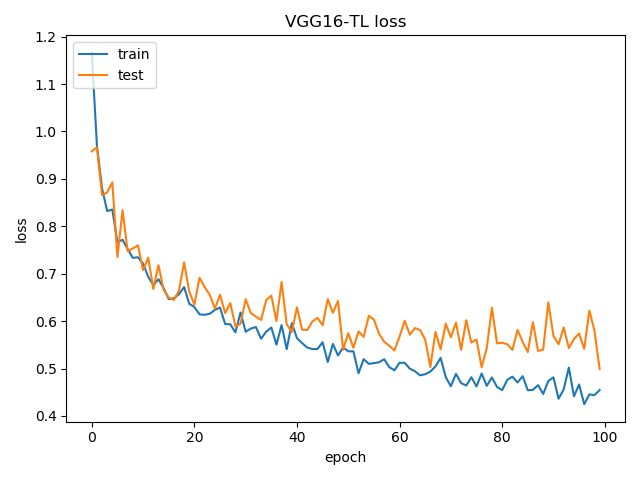
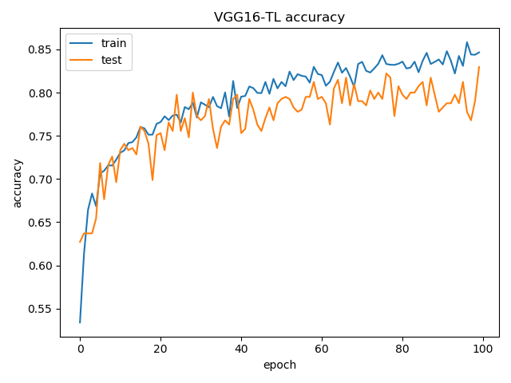
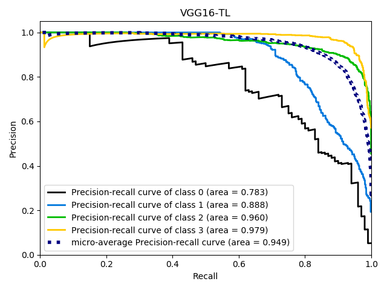

# Machine Learning: Weather Classification
This work aims to solve an image classification problem using convolutional neural networks (CNN) either trained from scratch or pre-trained. In particular, the problem is to predict, given an image, weather conditions which are divided into {*Rainy, Snowy, Sunny, Haze*}.

See [Report](report.pdf).

*"La Sapienza" University of Rome - MSc in Artificial Intelligence and Robotics*, Machine Learning 2019/2020
\
\
  

  
